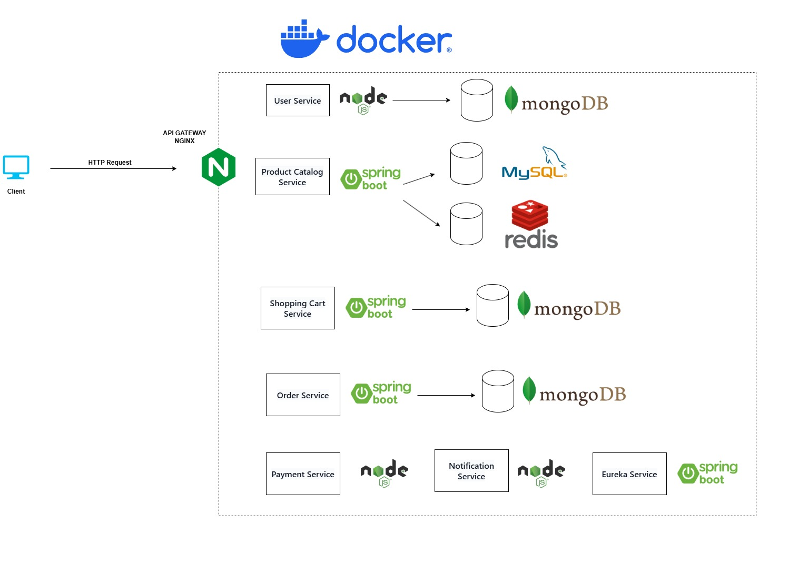

# ecommerce-scalable
Plataforma de comercio electrónico desarrollada bajo la arquitectura de microservicios.

En construcción... 🚀⏳

Tecnologías y herramientas utilizadas:
- Spring Boot (Java)
- Node.js (Typescript)
- Nginx
- Docker
- Eureka Server and Client
- JWT
- MySQL
- Redis
- MongoDB
- Kafka
- HTTP

ENDPOINTS
- POST /api/users/register
- POST /api/users/login
- GET /api/products
- POST /api/products
- DELETE /api/products/<producto_id>
- GET /api/categorias
- POST /api/categorias
- DELETE /api/categorias/<categoria_id>
- PUT /api/cart/<user_id>
- GET /api/cart/<user_id>
- DELETE /api/cart/<user_id>
- POST /api/orders/<user_id>
- PUT /api/orders/<user_id>
- GET /api/orders/<user_id>
- GET /api/orders
  
Payment y Notification Service se manejan de manera interna por Kafka.
